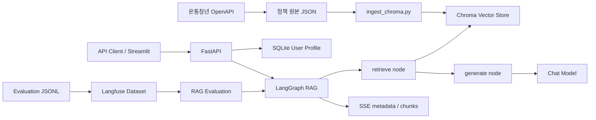

# 청년정책 RAG

온통청년 OpenAPI의 청년정책 데이터를 수집하고, 사용자 프로필을 반영해 관련
정책을 검색·안내하는 RAG(Retrieval-Augmented Generation) 시스템입니다.

## 주요 기능

- 온통청년 OpenAPI 청년정책 데이터 수집
- Chroma 기반 semantic search
- 사용자 프로필 기반 metadata filtering
- 정책 신청 방법, 기간, 자격 조건 등 상세 metadata를 포함한 답변 생성
- LangGraph `StateGraph` 기반 검색·생성 워크플로
- 사용자 ID별 SQLite 대화 기록 및 연속 대화
- FastAPI SSE 스트리밍 응답
- SQLite 기반 사용자 프로필 CRUD
- 정책 ID 기반 원본 정책 상세 조회 API
- Streamlit 기반 API 테스트 화면
- Langfuse Dataset과 evaluator를 이용한 RAG 품질 평가

## 시스템 구조



## 프로젝트 구조

```text
.
├── config.yaml                    # 모델, 저장소, 평가 설정
├── main.py                        # FastAPI 애플리케이션
├── demo_streamlit.py              # 로컬 테스트 UI
├── data/
│   ├── raw/                       # OpenAPI 원본 데이터
│   ├── chroma/                    # Chroma 영속 데이터
│   ├── sqlite/                    # 사용자 프로필 DB, 대화 checkpoint DB
│   └── eval/                      # 평가 데이터셋 JSONL
├── scripts/
│   ├── collect_data.py            # 정책 데이터 수집
│   ├── ingest_chroma.py           # 문서 임베딩 및 Chroma 적재
│   ├── generate_eval_dataset.py   # 평가 데이터 생성
│   ├── evaluate_embedding_retrieval.py # 임베딩 검색 평가
│   └── run_evaluation.py          # RAG 평가 실행
├── src/
│   ├── chat/
│   │   ├── models.py              # 대화 thread ID 저장 모델
│   │   ├── router.py              # chat API
│   │   └── schemas.py             # chat request schema
│   ├── policy/                    # 정책 상세 조회 모델과 API
│   ├── rag/
│   │   ├── graph.py               # LangGraph workflow와 public API
│   │   ├── nodes/
│   │   │   ├── router.py          # 검색 필요 여부 분기
│   │   │   ├── retriever.py       # 사용자 조건 기반 정책 검색
│   │   │   └── agent.py           # prompt 구성과 답변 생성
│   │   ├── state.py               # graph state schema
│   │   ├── prompts.py             # 라우터·생성 prompt
│   │   └── utils/formatting.py    # context와 사용자 프로필 포맷
│   ├── user/                      # 사용자 프로필 모델과 API
│   ├── config.py                  # config.yaml 로더
│   ├── database.py                # SQLite engine과 session
│   ├── dependencies.py            # FastAPI dependencies
│   ├── eval.py                    # 평가 데이터 검증 및 evaluator
│   ├── observability.py           # Langfuse tracing 설정
│   └── factory.py                 # 모델·RAG factory
└── tests/
```

## 설치

Python 가상환경을 만들고 의존성을 설치합니다.

```bash
python -m venv venv
source venv/bin/activate
pip install -r requirements.txt
```

## 설정

모델과 검색 설정은 `config.yaml`에서 관리합니다.

```yaml
retriever:
  provider: "upstage"
  query_model: "solar-embedding-1-large-query"
  passage_model: "solar-embedding-1-large-passage"
  search_k: 3

llm:
  provider: "upstage"
  model: "solar-pro3"

evaluation:
  example_path: "data/eval/eval_v1_50.jsonl"
  provider: "anthropic"
  model: "claude-haiku-4-5"
  dataset_name: "PolicyRAGEval_v2_50"
  experiment_prefix: "260709"
  max_concurrency: 3
```

Langfuse tracing과 평가 실행에는 `.env`에 다음 값이 필요합니다.

```bash
LANGFUSE_TRACING=true
LANGFUSE_PUBLIC_KEY=...
LANGFUSE_SECRET_KEY=...
LANGFUSE_BASE_URL=https://cloud.langfuse.com
```

## 데이터 준비

모든 명령은 프로젝트 루트에서 실행합니다.

### 1. 정책 데이터 수집

API 연결과 파일 생성을 10건으로 먼저 확인할 수 있습니다.

```bash
python -m scripts.collect_data --limit-test
```

전체 정책을 수집합니다.

```bash
python -m scripts.collect_data
```

수집 결과는 `config.yaml`의 `data.raw` 경로에 저장됩니다.

### 2. Chroma 적재

```bash
python -m scripts.ingest_chroma
```

정책명, 키워드, 카테고리, 정책 설명, 지원 내용을 임베딩하며 다음 정보는
metadata로 함께 저장합니다.

- 정책 ID와 분류
- 주관·운영 기관
- 지원 연령과 소득 조건
- 사업·신청 기간
- 신청 방법과 URL
- 추가 자격 조건과 제출 서류
- 지역, 직업, 성별, 혼인 상태

## 애플리케이션 실행

### FastAPI

```bash
uvicorn main:app --reload --host 127.0.0.1 --port 8000
```

- API 문서: `http://127.0.0.1:8000/docs`
- OpenAPI 스키마: `http://127.0.0.1:8000/openapi.json`

서버 시작 시 SQLite 테이블과 컴파일된 LangGraph RAG를 초기화합니다.

### LangGraph 워크플로

`src/rag/graph.py`의 그래프는 이전 대화와 현재 활성 문서를 보고 새 검색이
필요한지 먼저 판단합니다.

```text
START -> router -> retriever? -> agent -> END
```

- `router`: 현재 질문, 대화 기록, 기존 검색 문서를 보고 `retriever` 또는 `agent`로 분기
- `retriever`: 사용자 프로필로 Chroma metadata filter를 만들고 정책 문서를 검색
- `agent`: 검색 문서와 사용자 프로필을 prompt에 넣어 답변 생성
- graph state: `user_input`, `user_profile`, `exclude_expired`, `messages`, `documents`, `route`, `answer`
- conversation state: Human/AI 메시지를 사용자별 `thread_id`에 누적

동기 호출, 비동기 호출, SSE 스트리밍 모두 같은 컴파일된 그래프를 사용합니다.
사용자 프로필은 기존 SQLite DB에서 조회하고, 대화 상태는
`data/sqlite/conversations.db`의 LangGraph SQLite checkpointer에 별도로
저장합니다. `src/chat/models.py`의 `ConversationThread`가 사용자 ID별 thread ID를
관리하므로, 대화 기록 삭제 후에는 새 thread ID로 다음 대화를 시작합니다.
사용자 프로필을 삭제하면 해당 사용자의 대화 checkpoint도 함께 삭제됩니다.

### Streamlit 데모

FastAPI 서버를 먼저 실행한 뒤 별도 터미널에서 실행합니다.

```bash
streamlit run demo_streamlit.py --server.port 8501
```

브라우저에서 `http://127.0.0.1:8501`에 접속합니다. 다른 API 주소를 사용할
경우 환경변수로 지정할 수 있습니다.

```bash
YOUTH_RAG_API_URL=http://127.0.0.1:8001 \
streamlit run demo_streamlit.py --server.port 8501
```

## API

| Method | Endpoint | 설명 |
| --- | --- | --- |
| `POST` | `/user/registration` | 사용자 프로필 등록 |
| `GET` | `/user/{user_id}` | 사용자 프로필 조회 |
| `POST` | `/user/{user_id}` | 사용자 프로필 수정 |
| `DELETE` | `/user/{user_id}` | 사용자 프로필 삭제 |
| `GET` | `/policies/{policy_id}` | 정책 상세 정보 조회 |
| `POST` | `/chat` | 사용자 프로필 기반 정책 검색 및 SSE 답변 |
| `DELETE` | `/chat/{user_id}` | 사용자 대화 기록 삭제 |

사용자 등록 예시:

```bash
curl -X POST http://127.0.0.1:8000/user/registration \
  -H "Content-Type: application/json" \
  -d '{
    "user_id": "sample-user",
    "age": 27,
    "gender": "여성",
    "job": "구직자",
    "income": 3000,
    "region": "서울특별시"
  }'
```

스트리밍 채팅 예시:

```bash
curl -N -X POST http://127.0.0.1:8000/chat \
  -H "Content-Type: application/json" \
  -d '{
    "user_id": "sample-user",
    "user_input": "서울에서 지원받을 수 있는 주거 정책을 알려줘",
    "exclude_expired": true
  }'
```

SSE 응답은 검색 context와 정책 ID를 담은 `metadata`, 답변 텍스트를 담은
`chunk`, 완료를 알리는 `done` 이벤트 순서로 전달됩니다.

## RAG 평가

평가 데이터는 `config.yaml`의 `evaluation.example_path`에서 관리합니다. 각 사례는
질문, 사용자 프로필, 정답 정책 ID, 만료 정책 제외 여부, metadata를 포함합니다.

평가 데이터를 생성합니다.

```bash
python -m scripts.generate_eval_dataset --sample-size 100 --overwrite
```

Langfuse Dataset을 생성하거나 갱신하고, LangGraph RAG와 evaluator를 실행합니다.

```bash
python -m scripts.run_evaluation
```

임베딩 검색만 별도로 평가할 수도 있습니다.

```bash
python -m scripts.evaluate_embedding_retrieval
```

평가 지표:

| 지표 | 계산 방식 |
| --- | --- |
| Context Recall | 정답 정책 ID 중 검색된 정책 ID의 비율 |
| Context Average Helpfulness | 검색된 각 context가 질문과 프로필에 얼마나 도움이 되는지 LLM judge로 평가 |
| Faithfulness | 답변의 사실 주장이 검색 context에 근거하는지 LLM judge로 평가 |
| Answer Relevance | 답변이 질문과 사용자 프로필 요구에 직접 답하는지 LLM judge로 평가 |

Context Recall은 정책 ID를 직접 비교하고, Context Average Helpfulness,
Faithfulness, Answer Relevance는 평가 모델을 호출합니다.

## 테스트

```bash
PYTHONPATH=.:src python -m pytest tests -q
```
