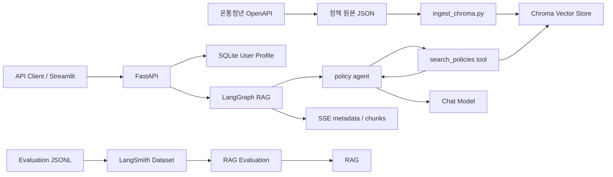

# 청년정책 RAG

온통청년 OpenAPI의 청년정책 데이터를 수집하고, 사용자 프로필을 반영해 관련
정책을 검색·안내하는 RAG(Retrieval-Augmented Generation) 시스템입니다.

## 주요 기능

- 온통청년 OpenAPI 청년정책 데이터 수집
- Chroma 기반 semantic search
- 사용자 프로필 기반 metadata filtering
- 정책 신청 방법, 기간, 자격 조건 등 상세 metadata를 포함한 답변 생성
- LangGraph `StateGraph` 기반 검색·생성 워크플로
- 사용자 ID별 SQLite 대화 기록 및 연속 대화
- FastAPI SSE 스트리밍 응답
- SQLite 기반 사용자 프로필 CRUD
- Streamlit 기반 API 테스트 화면
- LangSmith Dataset과 evaluator를 이용한 RAG 품질 평가

## 시스템 구조



## 프로젝트 구조

```text
.
├── config.yaml                    # 모델, 저장소, 평가 설정
├── main.py                        # FastAPI 애플리케이션
├── demo_streamlit.py              # 로컬 테스트 UI
├── data/
│   ├── raw/                       # OpenAPI 원본 데이터
│   ├── chroma/                    # Chroma 영속 데이터
│   ├── sqlite/                    # 사용자 프로필 DB, 대화 checkpoint DB
│   └── eval/examples.jsonl        # 평가 데이터셋
├── scripts/
│   ├── collect_data.py            # 정책 데이터 수집
│   ├── ingest_chroma.py           # 문서 임베딩 및 Chroma 적재
│   ├── create_eval_dataset.py     # LangSmith Dataset 생성·갱신
│   └── run_evaluation.py          # RAG 평가 실행
├── src/
│   ├── chat/
│   │   └── router.py              # chat API
│   ├── rag/
│   │   ├── graph.py               # LangGraph workflow
│   │   ├── retriever.py           # 사용자 조건 기반 정책 검색
│   │   ├── tools.py               # 정책 검색 tool
│   │   ├── agent.py               # tool calling과 답변 생성
│   │   ├── summarizer.py          # 대화 압축
│   │   ├── state.py               # graph state schema
│   │   └── prompts.py             # 생성·요약 prompt
│   ├── user/                      # 사용자 프로필 모델과 API
│   ├── config.py                  # config.yaml 로더
│   ├── database.py                # SQLite engine과 session
│   ├── dependencies.py            # FastAPI dependencies
│   ├── evaluators.py              # 평가 데이터 검증 및 evaluator
│   └── factory.py                 # 모델·RAG factory
└── tests/
```

## 설치

Python 가상환경을 만들고 의존성을 설치합니다.

```bash
python -m venv venv
source venv/bin/activate
pip install -r requirements.txt
```

## 설정
프로젝트 루트의 `.env.example`을 복사해 `.env`를 만듭니다.

```bash
cp .env.example .env
```

현재 `config.yaml`의 기본 설정으로 애플리케이션을 실행하려면
`UPSTAGE_API_KEY`가 필요합니다. 데이터 수집, 다른 provider 사용, RAG 평가에
필요한 키는 사용하는 기능에 맞게 추가합니다.


| 환경변수 | 사용하는 기능 | 필수 여부 |
| --- | --- | --- |
| `YOUTH_API_KEY` | `scripts.collect_data` 정책 데이터 수집 | 데이터 수집 시 필수 |
| `UPSTAGE_API_KEY` | Upstage embedding과 chat model | 현재 기본 설정에서 필수 |
| `OPENAI_API_KEY` | OpenAI chat model 또는 evaluator | OpenAI provider 사용 시 필수 |
| `GEMINI_API_KEY` | Google embedding 또는 chat model | Google provider 사용 시 필수 |
| `LANGSMITH_API_KEY` | Dataset 생성, 평가, tracing | LangSmith 사용 시 필수 |
| `LANGSMITH_TRACING` | LangChain·LangGraph trace 전송 | 선택 |
| `LANGSMITH_ENDPOINT` | LangSmith API region 지정 | LangSmith 사용 시 권장 |
| `LANGSMITH_PROJECT` | trace를 저장할 LangSmith project | tracing 사용 시 권장 |

모델과 검색 설정은 `config.yaml`에서 관리합니다.

```yaml
retriever:
  provider: "upstage"
  query_model: "solar-embedding-1-large-query"
  passage_model: "solar-embedding-1-large-passage"
  search_k: 3

llm:
  provider: "upstage"
  model: "solar-pro3"
  max_input_tokens: 32768
  summary_trigger_ratio: 0.65
  summary_keep_recent_turns: 3
  token_chars_per_token: 2.0

evaluation:
  example_path: "data/eval/examples.jsonl"
  provider: "openai"
  model: "gpt-5.4-mini"
  dataset_name: "Youth Policy RAG Sample"
  experiment_prefix: "youth-policy-rag"
  max_concurrency: 1
```

## 데이터 준비

모든 명령은 프로젝트 루트에서 실행합니다.

### 1. 정책 데이터 수집

API 연결과 파일 생성을 10건으로 먼저 확인할 수 있습니다.

```bash
python -m scripts.collect_data --limit-test
```

전체 정책을 수집합니다.

```bash
python -m scripts.collect_data
```

수집 결과는 `config.yaml`의 `data.raw` 경로에 저장됩니다.

### 2. Chroma 적재

```bash
python -m scripts.ingest_chroma
```

정책명, 키워드, 카테고리, 정책 설명, 지원 내용을 임베딩하며 다음 정보는
metadata로 함께 저장합니다.

- 정책 ID와 분류
- 주관·운영 기관
- 지원 연령과 소득 조건
- 사업·신청 기간
- 신청 방법과 URL
- 추가 자격 조건과 제출 서류
- 지역, 직업, 성별, 혼인 상태

## 애플리케이션 실행

### FastAPI

```bash
uvicorn main:app --reload --host 127.0.0.1 --port 8000
```

- API 문서: `http://127.0.0.1:8000/docs`
- OpenAPI 스키마: `http://127.0.0.1:8000/openapi.json`

서버 시작 시 SQLite 테이블과 컴파일된 LangGraph RAG를 초기화합니다.

### LangGraph 워크플로

```text
START -> prepare -> summarize? -> agent
                                ├─ tools -> summarize? -> agent
                                └─ END
```

- `prepare`: 문서·프로필 변경을 기준으로 `required/optional` 검색 모드 결정
- `summarize`: prompt 임계값 초과 시 오래된 대화 압축
- `agent`: 검색 모드에 따라 Tool을 강제 호출하거나, 기존 문서로 답변하거나,
  필요할 때만 Tool 호출
- `tools`: 사용자 프로필 조건으로 정책 문서를 검색하고 검색 모드를
  `disabled`로 변경

검색 모드별 Agent 동작:

- `required`: 최초 요청·문서 없음·검색 조건 변경 시
  `tool_choice="search_policies"`로 검색 강제
- `optional`: 기존 문서가 유효할 때 `tool_choice="auto"`로 모델이 검색 여부 판단
- `disabled`: Tool 실행 후 Tool이 없는 chain으로 최종 답변 생성

### Streamlit 데모

FastAPI 서버를 먼저 실행한 뒤 별도 터미널에서 실행합니다.

```bash
streamlit run demo_streamlit.py --server.port 8501
```

브라우저에서 `http://127.0.0.1:8501`에 접속합니다. 다른 API 주소를 사용할
경우 환경변수로 지정할 수 있습니다.

```bash
YOUTH_RAG_API_URL=http://127.0.0.1:8001 \
streamlit run demo_streamlit.py --server.port 8501
```

## API

| Method | Endpoint | 설명 |
| --- | --- | --- |
| `POST` | `/user/registration` | 사용자 프로필 등록 |
| `GET` | `/user/{user_id}` | 사용자 프로필 조회 |
| `POST` | `/user/{user_id}` | 사용자 프로필 수정 |
| `DELETE` | `/user/{user_id}` | 사용자 프로필 삭제 |
| `POST` | `/chat` | 사용자 프로필 기반 정책 검색 및 SSE 답변 |
| `DELETE` | `/chat/history/{user_id}` | 사용자 프로필은 유지하고 대화 기록 초기화 |

사용자 등록 예시:

```bash
curl -X POST http://127.0.0.1:8000/user/registration \
  -H "Content-Type: application/json" \
  -d '{
    "user_id": "sample-user",
    "age": 27,
    "gender": "여성",
    "job": "구직자",
    "income": 3000,
    "region": "서울특별시"
  }'
```

스트리밍 채팅 예시:

```bash
curl -N -X POST http://127.0.0.1:8000/chat \
  -H "Content-Type: application/json" \
  -d '{
    "user_id": "sample-user",
    "user_input": "서울에서 지원받을 수 있는 주거 정책을 알려줘",
    "exclude_expired": true
  }'
```

SSE 응답은 검색 context와 정책 ID를 담은 `metadata`, 답변 텍스트를 담은
`chunk`, 완료를 알리는 `done` 이벤트 순서로 전달됩니다.

대화 기록 초기화 예시:

```bash
curl -X DELETE \
  http://127.0.0.1:8000/chat/history/sample-user
```

대화 기록을 초기화하면 사용자 프로필은 유지되며, 다음 질문은 기존 대화와 검색
문서가 없는 새로운 대화로 처리됩니다. Streamlit의 `대화 기록 초기화` 버튼을
사용하면 서버의 대화 기록과 현재 화면의 메시지를 함께 삭제할 수 있습니다.

## RAG 평가

평가 데이터는 `data/eval/examples.jsonl`에서 관리합니다. 각 사례는 질문,
사용자 프로필, 기준 답변, 기준 context, 정답 정책 ID를 포함합니다.

LangSmith Dataset을 생성하거나 갱신합니다.

```bash
python -m scripts.create_eval_dataset
```

LangGraph RAG와 evaluator를 실행합니다.

```bash
python -m scripts.run_evaluation
```

평가 지표:

| 지표 | 계산 방식 |
| --- | --- |
| Context Recall | 정답 정책 ID 중 검색된 정책 ID의 비율 |
| Context Precision | 검색 순위에 따른 정답 정책 ID의 Average Precision |
| Faithfulness | 답변의 사실 주장이 검색 context에 근거하는지 LLM judge로 평가 |
| Answer Relevance | 답변이 질문과 사용자 프로필 요구에 직접 답하는지 LLM judge로 평가 |

Context Recall과 Context Precision은 정책 ID를 직접 비교하고, Faithfulness와
Answer Relevance만 평가 모델을 호출합니다.

## 테스트

```bash
python -m unittest discover -s tests
```
