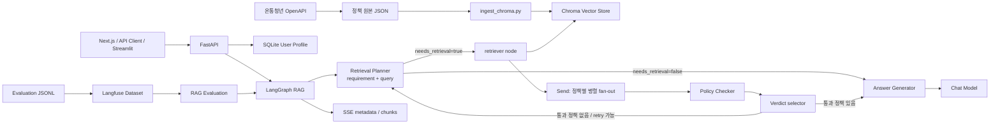

# 청년정책 RAG

온통청년 OpenAPI의 청년정책 데이터를 수집하고, 사용자 프로필을 반영해 관련
정책을 검색·안내하는 RAG(Retrieval-Augmented Generation) 시스템입니다.

## 주요 기능

- 온통청년 OpenAPI 청년정책 데이터 수집
- Chroma 기반 semantic search
- 사용자 프로필 기반 metadata filtering
- 정책 신청 방법, 기간, 자격 조건 등 상세 metadata를 포함한 답변 생성
- LangGraph `StateGraph` 기반 Retrieval Planner·검색·검수·생성 워크플로
- 현재 질문, 대화 기록, 활성 문서를 바탕으로 한 검색/재사용 분기
- `Send`를 이용한 검색 문서별 Policy Checker 병렬 평가
- 명시적인 정책 적합성 verdict와 최대 3회 재검색
- 탈락 정책을 제외한 동일 Query 재사용 또는 필요 시 의미 기반 Query 변경
- Checker를 통과한 정책만 사용하는 답변 생성
- 사용자 ID별 SQLite 대화 기록 및 연속 대화
- FastAPI SSE 스트리밍 응답
- SQLite 기반 사용자 프로필 CRUD
- 정책 ID 기반 원본 정책 상세 조회 API
- Next.js 기반 실서비스형 상담 프론트엔드
- 서버 발급 익명 세션, 30일 보존, 프로필·상담 기록 삭제
- 답변 근거 정책을 표시하는 활성 정책 카드
- Streamlit 기반 API 테스트 화면
- Langfuse Dataset과 evaluator를 이용한 RAG 품질 평가

## 시스템 구조



## 프로젝트 구조

```text
.
├── config.yaml                    # 모델, 저장소, 평가 설정
├── main.py                        # FastAPI 애플리케이션
├── frontend/                      # Next.js 상담 웹서비스
├── deploy/                        # Nginx·systemd 배포 예시
├── demo_streamlit.py              # 로컬 테스트 UI
├── data/
│   ├── raw/                       # OpenAPI 원본 데이터
│   ├── chroma/                    # Chroma 영속 데이터
│   ├── sqlite/                    # 사용자 프로필 DB, 대화 checkpoint DB
│   └── eval/                      # 평가 데이터셋 JSONL
├── scripts/
│   ├── collect_data.py            # 정책 데이터 수집
│   ├── ingest_chroma.py           # 문서 임베딩 및 Chroma 적재
│   ├── generate_eval_dataset.py   # 평가 데이터 생성
│   ├── generate_planner_query_cache.py # Planner query 고정
│   ├── evaluate_retrieval.py      # local/Langfuse retrieval 평가
│   └── evaluate_rag.py            # Langfuse RAG 평가 실행
├── src/
│   ├── evaluation/                # 평가 스키마, 지표, 실험 로직
│   ├── chat/
│   │   ├── models.py              # 대화 thread ID 저장 모델
│   │   ├── router.py              # chat API
│   │   └── schemas.py             # chat request schema
│   ├── policy/                    # 정책 상세 조회 모델과 API
│   ├── rag/
│   │   ├── graph.py               # LangGraph workflow와 public API
│   │   ├── nodes/
│   │   │   ├── retrieval_planner.py # 검색 여부·사용자 요구·검색 질의 계획
│   │   │   ├── retriever.py       # 사용자 조건 기반 정책 검색
│   │   │   ├── policy_checker.py  # 문서별 적합도 병렬 평가
│   │   │   ├── policy_selector.py # verdict 기반 정책 선택
│   │   │   └── answer_generator.py # 검수된 정책 기반 답변 생성
│   │   ├── retrievers/
│   │   │   ├── dense_retriever.py # Chroma dense 검색
│   │   │   ├── bm25_retriever.py  # Kiwi BM25 검색
│   │   │   └── ensemble_retriever.py # weighted RRF hybrid 검색
│   │   ├── state.py               # graph state schema
│   │   └── utils.py               # context와 사용자 프로필 포맷
│   ├── user/                      # 사용자 프로필 모델과 API
│   ├── config.py                  # config.yaml 로더
│   ├── database.py                # SQLite engine과 session
│   ├── dependencies.py            # FastAPI dependencies
│   ├── eval.py                    # 평가 데이터 검증 및 evaluator
│   ├── observability.py           # Langfuse tracing 설정
│   ├── checkpointer.py            # SQLite LangGraph checkpointer
│   └── factory.py                 # 모델·RAG factory
└── tests/
```

## 설치

`uv`로 Python 환경과 의존성을 관리합니다.

```bash
uv sync
```

명령은 가상환경을 활성화하지 않고 실행합니다.

```bash
uv run python -m scripts.collect_data --limit-test
uv run uvicorn main:app --reload
uv run streamlit run demo_streamlit.py
```

## 설정

모델과 검색 설정은 `config.yaml`에서 관리합니다.

```yaml
retriever:
  provider: "upstage"
  query_model: "solar-embedding-1-large-query"
  passage_model: "solar-embedding-1-large-passage"
  search_k: 3

llm:
  provider: "deepseek"
  model: "deepseek-v4-flash"

rag:
  planner:
    history_window: 6
  policy_checker:
    max_retries: 3
  answer_generator:
    history_window: 10

evaluation:
  example_path: "data/eval/eval_v1_50.jsonl"
  provider: "anthropic"
  model: "claude-haiku-4-5"
  dataset_name: "PolicyRAGEval_v2_50"
  experiment_prefix: "260709"
  max_concurrency: 3
```

정책 수집과 현재 기본 모델 실행에는 provider별 API 키가 필요합니다. 예를 들어
현재 `config.yaml` 설정을 그대로 사용할 때는 다음 값을 `.env`에 둡니다.

```bash
YOUTH_API_KEY=...
UPSTAGE_API_KEY=...
DEEPSEEK_API_KEY=...
```

Langfuse tracing은 선택 사항이며, 아래 값이 모두 설정되고
`LANGFUSE_TRACING`이 활성화된 경우에만 동작합니다.

```bash
LANGFUSE_TRACING=true
LANGFUSE_PUBLIC_KEY=...
LANGFUSE_SECRET_KEY=...
LANGFUSE_BASE_URL=https://cloud.langfuse.com
```

## 데이터 준비

모든 명령은 프로젝트 루트에서 실행합니다.

### 1. 정책 데이터 수집

API 연결과 파일 생성을 10건으로 먼저 확인할 수 있습니다. 테스트 결과는
`data/raw/youth_policies.sample.json`에 저장되어 운영 원본을 덮어쓰지 않습니다.

```bash
uv run python -m scripts.collect_data --limit-test
```

전체 정책을 수집합니다.

```bash
uv run python -m scripts.collect_data
```

수집 결과는 `config.yaml`의 `data.raw` 경로에 저장됩니다.

기존 원본 JSON과 Chroma 컬렉션에 신규 정책만 추가할 때는 먼저 변경
예정 건수를 확인합니다.

```bash
uv run python -m scripts.sync_new_policies --dry-run
```

확인 후 증분 동기화를 실행합니다.

```bash
uv run python -m scripts.sync_new_policies
```

`plcyNo`가 로컬 원본에 없는 정책만 추가하고, API에서 더 이상 조회되지 않는
기존 정책은 삭제하지 않습니다. API 페이지 일부가 누락되거나 원본 JSON과
Chroma의 기존 ID가 다르면 변경 없이 중단합니다. 설정을 따로 지정하지 않으면
`config.yaml`의 원본 경로, Chroma 경로·컬렉션, `retriever.provider`,
`retriever.passage_model`을 사용합니다. 실행 중인 API 서버가 있다면 동기화
후 재시작해야 메모리의 BM25 인덱스에도 반영됩니다.

### 2. Chroma 적재

```bash
uv run python -m scripts.ingest_chroma
```

정책명, 키워드, 카테고리, 정책 설명, 지원 내용을 임베딩하며 다음 정보는
metadata로 함께 저장합니다.

- 정책 ID와 분류
- 주관·운영 기관
- 지원 연령과 소득 조건
- 사업·신청 기간
- 신청 방법과 URL
- 추가 자격 조건과 제출 서류
- 지역, 직업, 성별, 혼인 상태

## 애플리케이션 실행

### FastAPI

```bash
uvicorn main:app --reload --host 127.0.0.1 --port 8000
```

- API 문서: `http://127.0.0.1:8000/docs`
- OpenAPI 스키마: `http://127.0.0.1:8000/openapi.json`

서버 시작 시 SQLite 테이블과 컴파일된 LangGraph RAG를 초기화합니다.

### LangGraph 워크플로

`src/rag/graph.py`의 그래프는 매 턴 Retrieval Planner가 현재 질문, 최근
대화, 사용자 프로필, checkpoint의 활성 정책을 보고 검색 필요 여부와 Query를
결정합니다. 새로 검색한 문서는 각각 독립된 `Send` 작업으로 Policy Checker에
전달되어 병렬 평가됩니다.

```text
START
  -> retrieval_planner
  -> retriever?
  -> Send(policy_checker × N)
  -> policy_selector
  -> answer_generator
  -> END
```

- `retrieval_planner`: `user_requirement`, `needs_retrieval`,
  `retrieval_query`, `retrieval_reason`을 구조화해 반환
- `needs_retrieval=false`: 활성 정책 재사용이나 단순 응답처럼 검색 없이 답변 가능
- `retriever`: 연령·지역·신청기간으로 Chroma metadata filter를 만들고 정책 문서를 검색.
  소득은 하드 필터에 사용하지 않고 Policy Checker가 확인이 필요한 적합성 조건으로 판단
- `policy_checker`: 검색 문서 수만큼 `Send`로 fan-out되며 각 정책에
  `direct_fit`, `fit_needs_clarification`, `indirect`, `mismatch` verdict와 근거를 생성
- `policy_selector`: `direct_fit`과 `fit_needs_clarification` 정책만 선택
- 통과 정책이 없으면 `indirect`·`mismatch` 정책을 다음 검색에서 제외하고
  `max_retries`까지 재검색. Query는 탈락 사유상 검색 방향을 바꿀 필요가 있을 때만
  Planner가 변경하며, 단순 접미사 추가 같은 기계적 변경은 하지 않는다.
  제외 적용 후 빈 결과가 나온 상태에서 Planner도 같은 Query를 제안하면 조기 종료한다.
  기본값 3은 최초 검색을 포함해 최대 4번 검색한다는 의미
- `answer_generator`: Checker를 통과한 정책, 사용자 프로필, 최근 대화만으로 답변 생성
- graph state: `user_input`, `user_profile`, `exclude_expired`, `messages`,
  `user_requirement`, `needs_retrieval`, `retrieval_query`, `retrieval_count`,
  `retrieved_policies`, `checked_policies`, `active_policies`, `documents`, `answer`.
  `retrieved_policies`는 이번 검색 후보, `checked_policies`는 현재 턴의 누적 판정,
  `documents`는 이번 답변 근거, `active_policies`는 다음 턴에도 유지할 통과 정책이다.
- conversation state: Human/AI 메시지를 사용자별 `thread_id`에 누적

### Next.js 프론트엔드

FastAPI는 loopback에서 실행하고, Next.js가 브라우저의 `/api/*` 요청을
FastAPI로 프록시합니다.

```bash
uv run --locked uvicorn main:app --host 127.0.0.1 --port 8000
```

별도 터미널에서 실행합니다.

```bash
cd frontend
cp .env.example .env.local
npm ci
npm run dev
```

같은 와이파이의 테스트 참여자에게 공개할 때는 `npm run dev:lan`을 사용하고
`http://<컴퓨터의 사설 IP>:3000`으로 접속합니다. FastAPI 8000 포트는
LAN에 공개할 필요가 없습니다.

프론트 제품 범위는 `docs/frontend_product_spec.md`, 로컬·EC2 배포 구조는
`docs/frontend_deployment.md`를 참고합니다.

### Streamlit 데모

FastAPI 서버를 먼저 실행한 뒤 별도 터미널에서 실행합니다.

```bash
streamlit run demo_streamlit.py --server.port 8501
```

브라우저에서 `http://127.0.0.1:8501`에 접속합니다. 다른 API 주소를 사용할
경우 환경변수로 지정할 수 있습니다.

```bash
YOUTH_RAG_API_URL=http://127.0.0.1:8001 \
streamlit run demo_streamlit.py --server.port 8501
```

## API

| Method | Endpoint | 설명 |
| --- | --- | --- |
| `POST` | `/user/registration` | 사용자 프로필 등록 |
| `GET` | `/user/{user_id}` | 사용자 프로필 조회 |
| `POST` | `/user/{user_id}` | 사용자 프로필 수정 |
| `DELETE` | `/user/{user_id}` | 사용자 프로필 삭제 |
| `GET` | `/policies/{policy_id}` | 정책 상세 정보 조회 |
| `POST` | `/policies/batch` | 여러 정책 상세 정보 조회 |
| `POST` | `/chat` | 사용자 프로필 기반 정책 검색 및 SSE 답변 |
| `DELETE` | `/chat/{user_id}` | 사용자 대화 기록 삭제 |
| `POST` | `/sessions/anonymous` | 30일 익명 상담 세션 생성 |
| `GET` | `/sessions/current` | 현재 익명 세션과 프로필 조회 |
| `PATCH` | `/me/profile` | 현재 세션의 프로필 수정 |
| `GET` | `/me/conversation` | 현재 세션의 상담과 활성 정책 복원 |
| `POST` | `/me/chat` | 익명 세션 기반 SSE 상담 |
| `DELETE` | `/me/conversation` | 현재 상담 기록 초기화 |
| `DELETE` | `/me/data` | 프로필·상담·익명 세션 전체 삭제 |

사용자 등록 예시:

```bash
curl -X POST http://127.0.0.1:8000/user/registration \
  -H "Content-Type: application/json" \
  -d '{
    "user_id": "sample-user",
    "age": 27,
    "gender": "여성",
    "job": "구직자",
    "income": 3000,
    "region": "서울특별시"
  }'
```

스트리밍 채팅 예시:

```bash
curl -N -X POST http://127.0.0.1:8000/chat \
  -H "Content-Type: application/json" \
  -d '{
    "user_id": "sample-user",
    "user_input": "서울에서 지원받을 수 있는 주거 정책을 알려줘",
    "exclude_expired": true
  }'
```

SSE 응답은 검색 context와 정책 ID를 담은 `metadata`, 답변 텍스트 조각을 담은
`chunk`, 완료를 알리는 `done` 이벤트로 전달됩니다.

```text
data: {"type":"metadata","data":{"contexts":[...],"retrieved_policy_ids":[...]}}

data: {"type":"chunk","data":"답변 일부"}

data: {"type":"done"}
```

## RAG 평가

평가 데이터는 `config.yaml`의 `evaluation.example_path`에서 관리합니다. 각 사례는
질문, 사용자 프로필, 정답 정책 ID, 만료 정책 제외 여부, metadata를 포함합니다.

평가 데이터를 생성합니다.

```bash
uv run python -m scripts.generate_eval_dataset --sample-size 100 --overwrite
```

기본 생성 크기는 500건이며, 재현 가능한 생성을 위해 seed는 기본값 `42`를
사용합니다. 여러 모델을 섞어 질문을 생성하려면
`--generation-model PROVIDER/MODEL=WEIGHT` 옵션을 사용할 수 있습니다.

Langfuse Dataset을 생성하거나 갱신하고, LangGraph RAG와 evaluator를 실행합니다.

```bash
uv run python -m scripts.evaluate_rag
```

같은 retrieval 진입점에서 dense, BM25, hybrid를 local 또는
Langfuse 실험으로 평가합니다.

```bash
uv run python -m scripts.evaluate_retrieval run \
  --tracking local \
  --provider upstage \
  --model solar-embedding-1-large-query \
  --chroma-dir data/chroma \
  --retrieval-mode dense
```

Planner query cache는 현재 Planner 출력과 동일한 schema version 2를 사용합니다.
기존 `planner_route`, `answer_strategy`, `retrieval_queries` 기반 캐시는 호환되지
않으므로 새 파일로 다시 생성해야 합니다. Planner query cache나 hybrid 가중치
sweep의 전체 옵션은 각각
`uv run python -m scripts.generate_planner_query_cache --help`,
`uv run python -m scripts.evaluate_retrieval sweep --help`로 확인할 수 있습니다.

평가 지표:

| 지표 | 계산 방식 |
| --- | --- |
| Context Recall | 정답 정책 ID 중 검색된 정책 ID의 비율 |
| Context Average Helpfulness | 검색된 각 context가 질문과 프로필에 얼마나 도움이 되는지 LLM judge로 평가 |
| Faithfulness | 답변의 사실 주장이 검색 context에 근거하는지 LLM judge로 평가 |
| Answer Relevance | 답변이 질문과 사용자 프로필 요구에 직접 답하는지 LLM judge로 평가 |

Context Recall은 정책 ID를 직접 비교하고, Context Average Helpfulness,
Faithfulness, Answer Relevance는 평가 모델을 호출합니다.

관찰된 답변 실패 사례는 별도 회귀셋으로 다시 실행할 수 있습니다.

```bash
uv run python scripts/rerun_failed_answer_cases.py \
  --run-id <run-id> \
  --fail-on-automated-check
```

케이스 추가 방법, 자동 검사와 정성 판정의 구분, 만료 정책 포함 진단은
`docs/failure_regression_suite.md`를 참고합니다.

## 테스트

```bash
uv run pytest -q
```
