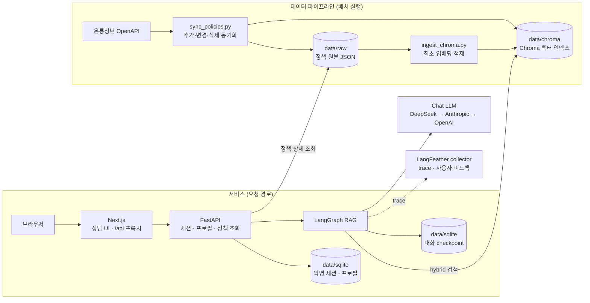
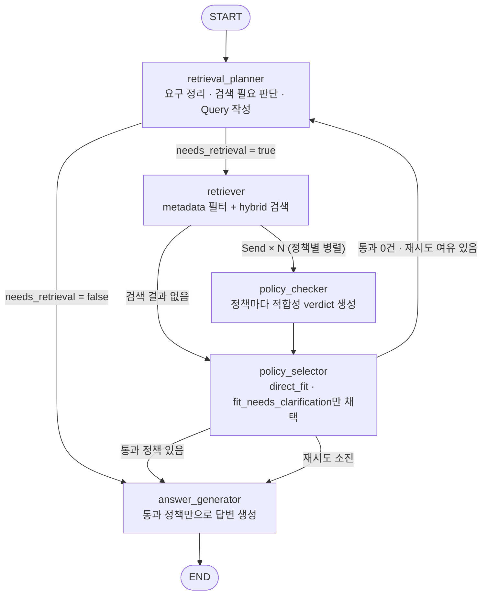

# 청년정책 RAG

온통청년 OpenAPI의 청년정책 데이터를 수집하고, 사용자 프로필을 반영해 관련
정책을 검색·안내하는 RAG(Retrieval-Augmented Generation) 시스템입니다.

정책 문서를 그냥 검색해서 붙여주는 대신, **검색한 정책이 이 사용자에게 정말
해당되는지 LLM이 한 번 더 검수하고, 통과한 정책만으로 답변을 만듭니다.**
검수를 통과한 정책이 없으면 탈락 정책을 제외하고 다시 검색합니다.

- 백엔드: FastAPI + LangGraph + Chroma
- 프론트엔드: Next.js 상담 웹서비스 ([frontend/README.md](frontend/README.md))
- 배포: Docker Compose, GCP Compute Engine ([docs/deployment.md](docs/deployment.md))

## 주요 기능

**정책 데이터**

- 온통청년 OpenAPI 수집과 추가·변경·삭제 동기화(`sync_policies`)
- 신청 방법·기간·자격 조건 등을 metadata로 함께 보관해 답변에 사용

**검색**

- Chroma dense 검색 + Kiwi 형태소 BM25의 weighted RRF hybrid 검색
- 연령·지역·신청기간은 metadata 하드 필터, 소득은 Checker가 판단

**답변 생성 (LangGraph)**

- Retrieval Planner가 매 턴 검색 필요 여부와 검색 Query를 결정
- `Send`로 검색된 정책마다 Policy Checker를 병렬 실행해 적합성 verdict 생성
- 검수 통과 정책이 없으면 탈락 정책을 제외하고 최대 3회까지 재검색
- LLM provider 실패 시 retry → 다른 provider로 fallback

**웹 서비스**

- 서버 발급 익명 세션(30일)에 프로필과 대화 스레드를 함께 보관
- SSE 스트리밍 응답(`status` / `metadata` / `chunk` / `done`)
- 답변 근거 정책 카드, 프로필·상담 기록 삭제
- LLM 비용 남용을 막는 토큰 버킷 rate limit
- LangFeather로 trace와 사용자 피드백 수집

**평가**

- 로컬 LLM judge 기반 RAG 품질 평가와 retrieval 실험 스크립트

## 시스템 구조


```mermaid
flowchart LR
    subgraph ingest["데이터 파이프라인 (배치 실행)"]
        YOUTH["온통청년 OpenAPI"] --> SYNC["sync_policies.py<br/>추가·변경·삭제 동기화"]
        SYNC --> RAW[("data/raw<br/>정책 원본 JSON")]
        RAW --> INGEST["ingest_chroma.py<br/>최초 임베딩 적재"]
        SYNC --> CHROMA
        INGEST --> CHROMA[("data/chroma<br/>Chroma 벡터 인덱스")]
    end

    subgraph serve["서비스 (요청 경로)"]
        BROWSER["브라우저"] --> WEB["Next.js<br/>상담 UI · /api 프록시"]
        WEB --> API["FastAPI<br/>세션 · 프로필 · 정책 조회"]
        API --> RAG["LangGraph RAG"]
        API --> SESSDB[("data/sqlite<br/>익명 세션 · 프로필")]
        RAG --> CKPT[("data/sqlite<br/>대화 checkpoint")]
    end

    API -->|정책 상세 조회| RAW
    RAG -->|hybrid 검색| CHROMA
    RAG --> LLM["Chat LLM<br/>DeepSeek → Anthropic → OpenAI"]
    RAG -.trace.-> LF["LangFeather collector<br/>trace · 사용자 피드백"]
```

브라우저에 열리는 포트는 Next.js뿐이고, FastAPI는 내부 네트워크에서만
접근됩니다. `data/`는 컨테이너에 넣지 않고 호스트에서 마운트하므로 컨테이너를
교체해도 검색 인덱스와 상담 기록이 유지됩니다.

SQLite 두 개에 매 요청 쓰고 BM25 역색인을 프로세스 메모리에 들고 있어 **단일
인스턴스 전제**입니다.

### LangGraph 워크플로 구조


```mermaid
flowchart TD
    BEGIN([START]) --> PLANNER["retrieval_planner<br/>요구 정리 · 검색 필요 판단 · Query 작성"]
    PLANNER -->|"needs_retrieval = false"| GEN
    PLANNER -->|"needs_retrieval = true"| RET["retriever<br/>metadata 필터 + hybrid 검색"]
    RET -->|"Send × N (정책별 병렬)"| CHK["policy_checker<br/>정책마다 적합성 verdict 생성"]
    RET -->|"검색 결과 없음"| SEL
    CHK --> SEL["policy_selector<br/>direct_fit · fit_needs_clarification만 채택"]
    SEL -->|"통과 정책 있음"| GEN["answer_generator<br/>통과 정책만으로 답변 생성"]
    SEL -->|"통과 0건 · 재시도 여유 있음"| PLANNER
    SEL -->|"재시도 소진"| GEN
    GEN --> FINISH([END])
```

각 노드가 하는 일은 [애플리케이션 실행 > LangGraph 워크플로](#langgraph-워크플로)에
정리했습니다.

## 프로젝트 구조

```text
.
├── config.yaml                    # 모델, 검색, 저장소, 평가 설정
├── main.py                        # FastAPI 애플리케이션 (lifespan, /health)
├── compose.yaml, Dockerfile       # 로컬·배포 공통 컨테이너 정의
├── frontend/                      # Next.js 상담 웹서비스
├── deploy/                        # GCP 배포 (Compose·Caddy·부트스트랩 스크립트)
├── docs/
│   └── deployment.md              # Docker Compose · GCP 배포 가이드
├── data/
│   ├── raw/                       # OpenAPI 원본 정책 JSON
│   ├── chroma/                    # Chroma 영속 데이터
│   ├── sqlite/                    # 세션·프로필 DB, 대화 checkpoint DB
│   └── eval/                      # 평가 데이터셋과 실험 결과
├── scripts/
│   ├── sync_policies.py           # 정책 수집 및 원본·Chroma 동기화
│   ├── ingest_chroma.py           # 문서 임베딩 및 Chroma 적재
│   ├── generate_eval_dataset.py   # 평가 데이터 생성
│   ├── generate_planner_query_cache.py # 실험용 Planner query 고정
│   ├── evaluate_retrieval.py      # retrieval 평가 (dense·BM25·hybrid)
│   ├── evaluate_rag.py            # end-to-end RAG 품질 평가
│   └── rerun_failed_answer_cases.py # 실패 사례 회귀 재실행
├── src/
│   ├── config.py                  # config.yaml 로더 (pydantic 검증)
│   ├── factory.py                 # 모델·retriever·graph 조립, 임베딩 정합성 검증
│   ├── database.py                # SQLite engine과 session
│   ├── checkpointer.py            # SQLite LangGraph checkpointer
│   ├── dependencies.py            # FastAPI dependencies
│   ├── langfeather_runtime.py     # trace·피드백 전송 런타임
│   ├── rag/
│   │   ├── graph.py               # StateGraph 조립, invoke/stream API
│   │   ├── state.py               # graph state schema, verdict 정의
│   │   ├── nodes/                 # planner · retriever · checker · selector · generator
│   │   ├── retrievers/            # dense · BM25(Kiwi) · RRF ensemble · metadata filter
│   │   └── utils.py               # context·프로필 포맷
│   ├── session/                   # 익명 세션, 프로필, 채팅 API, rate limit, 만료 정리
│   ├── policy/                    # 정책 수집·적재·상세 조회
│   └── evaluation/                # 평가 스키마, 지표, 실험 로직
└── tests/
```

## 설치

`uv`로 Python 환경과 의존성을 관리합니다.

```bash
uv sync
```

가상환경을 활성화하지 않고 `uv run`으로 실행합니다.

```bash
uv run python -m scripts.sync_policies --limit-test
uv run uvicorn main:app --reload
```

## 설정

모델과 검색 설정은 `config.yaml`에서 관리합니다.

```yaml
retriever:
  provider: "upstage"                        # 임베딩 provider
  query_model: "solar-embedding-1-large-query"
  passage_model: "solar-embedding-1-large-passage"
  mode: "hybrid"                             # dense | hybrid
  search_k: 3                                # 최종 검색 문서 수
  dense_candidate_k: 10                      # hybrid에서 dense 후보 수
  bm25_candidate_k: 50                       # hybrid에서 BM25 후보 수
  hybrid_dense_weight: 0.65                  # RRF 가중치 (BM25는 1 - 이 값)
  hybrid_rrf_k: 1

llm:
  providers:                                 # 첫 번째가 main, 나머지가 fallback 순서
    - provider: "deepseek"
      model: "deepseek-v4-flash"
    - provider: "anthropic"
      model: "claude-haiku-4-5"
    - provider: "openai"
      model: "gpt-5.6-luna"

rag:
  planner:
    history_window: 6                        # Planner가 보는 최근 대화 수
  policy_checker:
    max_retries: 3                           # 최초 검색 포함 최대 4회
  answer_generator:
    history_window: 10
```

`llm.providers`는 순서가 곧 fallback 순서입니다. 각 provider는 재시도 가능한
오류(rate limit, timeout, 5xx)에 대해 `max_attempts`(기본 3)까지 지수 백오프로
재시도하고, 그래도 실패하면 다음 provider로 넘어갑니다.

`retriever.provider`·`passage_model`은 Chroma에 실제로 적재된 조합과 일치해야
합니다. 다르면 서버 기동 시 `verify_embedding_consistency`가 예외를 던집니다.

API 키는 `.env`에 둡니다. 필요한 키는 `config.yaml`이 지정한 provider에 따라
달라집니다. 위 기본 설정이라면 다음과 같습니다.

```bash
YOUTH_API_KEY=...      # 온통청년 OpenAPI
UPSTAGE_API_KEY=...    # 임베딩
DEEPSEEK_API_KEY=...   # main LLM
ANTHROPIC_API_KEY=...  # fallback LLM, 평가용 judge
OPENAI_API_KEY=...     # fallback LLM
```

전체 환경변수는 `.env.example`을 참고하세요. tracing과 쿠키 관련 값도 여기에
있습니다.

```bash
LANGFEATHER_TRACING=true
LANGFEATHER_ENDPOINT=http://127.0.0.1:4319
SESSION_COOKIE_SECURE=false   # HTTPS 배포에서는 true
```

RAG의 SSE `metadata`와 LangFeather trace는 같은 trace ID를 사용해서, 상담 화면의
도움됐어요/아쉬워요 피드백이 해당 trace에 저장됩니다. 전송은 best-effort이므로
collector가 꺼져 있어도 답변 생성은 계속되지만 피드백 API는 503을 반환합니다.
로컬에서 collector가 필요하면 다음을 띄웁니다.

```bash
docker run -d --name langfeather \
  -p 127.0.0.1:4319:4319 \
  -v langfeather-data:/data \
  ghcr.io/sungjinwi99/langfeather:0.3.2
```

## 데이터 준비

모든 명령은 프로젝트 루트에서 실행합니다. **처음 구축한다면 1 → 2 순서로 한 번씩
실행하면 됩니다.**

### 1. 정책 데이터 수집

수집과 동기화는 `scripts.sync_policies` 하나로 처리합니다.

```bash
# API 연결 확인 (10건만, data/raw/youth_policies.sample.json에 저장)
uv run python -m scripts.sync_policies --limit-test

# 최초 구축: 원본 JSON만 수집
uv run python -m scripts.sync_policies --snapshot-only

# 이미 Chroma가 있을 때: 반영 예정 건수 확인 후 실행
uv run python -m scripts.sync_policies --dry-run
uv run python -m scripts.sync_policies
```

API 응답을 정답으로 삼아 신규 정책 추가, 내용이 바뀐 정책 재적재, API에서 사라진
정책 삭제를 모두 반영합니다. 재적재 판정은 실제 임베딩 문서(본문 + metadata)
기준이라 조회수처럼 문서에 들어가지 않는 필드만 바뀐 정책은 다시 임베딩하지
않습니다.

삭제 대상이 원본의 5%(최소 20건)를 넘으면 API 응답 이상을 의심해 변경 없이
중단합니다. 의도한 삭제라면 `--allow-deletions`를 붙입니다. 중간에 실패해도 원본
JSON이 그대로 남아, 다시 실행하면 남은 작업만 마저 반영합니다.

동기화 후 서버를 재시작할 필요는 없습니다. API 서버가 원본 JSON의 mtime 변경을
감지해 BM25 인덱스를 백그라운드에서 다시 빌드합니다(최대 5분 지연).

### 2. Chroma 적재

```bash
uv run python -m scripts.ingest_chroma
```

정책명, 키워드, 카테고리, 정책 설명, 지원 내용을 임베딩하고 다음을 metadata로
저장합니다. 하드 필터와 Checker 판단, 답변의 상세 안내가 모두 이 metadata를
사용합니다.

- 정책 ID와 분류, 주관·운영 기관
- 지원 연령, 소득 조건, 지역·직업·성별·혼인 상태
- 사업·신청 기간, 신청 방법과 URL
- 추가 자격 조건과 제출 서류

## 애플리케이션 실행

### FastAPI

```bash
uv run uvicorn main:app --reload --host 127.0.0.1 --port 8000
```

- API 문서: `http://127.0.0.1:8000/docs`
- OpenAPI 스키마: `http://127.0.0.1:8000/openapi.json`

기동 시 SQLite 테이블을 만들고 LangGraph RAG를 컴파일하며, 만료 세션 정리와 BM25
새로고침 백그라운드 태스크를 띄웁니다. `/health`는 Chroma 컬렉션 접근과 문서 수만
확인합니다(외부 provider를 찌르지 않아 provider 지연이 컨테이너 재시작으로
번지지 않습니다). 문서가 0건이면 503입니다.

### Next.js 프론트엔드

FastAPI를 loopback에서 띄운 뒤, 별도 터미널에서 실행합니다. 브라우저 요청은
Next.js의 `/api/*` 프록시를 거치므로 FastAPI를 직접 노출할 필요가 없습니다.

```bash
cd frontend
cp .env.example .env.local
npm ci
npm run dev
```

같은 와이파이의 다른 기기에 공개하려면 `npm run dev:lan`을 쓰고
`http://<사설 IP>:3000`으로 접속합니다.

### LangGraph 워크플로

[위 구조도](#langgraph-워크플로-구조)의 각 노드가 하는 일입니다. 코드는
`src/rag/graph.py`와 `src/rag/nodes/`에 있습니다.

| 노드 | 하는 일 |
| --- | --- |
| `retrieval_planner` | 현재 질문·최근 대화·프로필·활성 정책을 보고 `user_requirement`, `needs_retrieval`, `retrieval_query`, `retrieval_reason`을 구조화해 반환 |
| `retriever` | 연령·지역·신청기간으로 metadata 필터를 만들고 hybrid 검색. 소득은 하드 필터에 쓰지 않고 Checker에게 넘김 |
| `policy_checker` | 검색 문서 수만큼 `Send`로 fan-out. 정책마다 `direct_fit` / `fit_needs_clarification` / `indirect` / `mismatch` verdict와 근거 생성 |
| `policy_selector` | `direct_fit`과 `fit_needs_clarification`만 채택 |
| `answer_generator` | 통과한 정책, 프로필, 최근 대화만으로 답변 생성 |

분기 규칙:

- `needs_retrieval=false`면 검색을 건너뜁니다. 활성 정책 재사용, 단순 인사, 이미
  답한 내용의 확인이 여기에 해당합니다. 활성 정책의 신청 방법·서류·일정 같은
  후속 질문도, 그 정보가 문서에 없더라도 재검색하지 않습니다(한 정책이 문서 하나에
  대응하므로 상세정보 부족은 다른 문서를 찾을 이유가 아닙니다).
- 통과 정책이 0건이면 `indirect`·`mismatch` 정책을 다음 검색에서 제외하고
  `max_retries`(기본 3, 최초 검색 포함 최대 4회)까지 재검색합니다. Query는 탈락
  사유상 검색 방향을 바꿀 필요가 있을 때만 Planner가 변경합니다.
- 제외를 적용해도 빈 결과이고 Planner가 같은 Query를 다시 제안하면 조기
  종료합니다.

state는 `src/rag/state.py`에 정의돼 있습니다. `retrieved_policies`는 이번 검색
후보, `checked_policies`는 현재 턴의 누적 판정, `documents`는 이번 답변의 근거,
`active_policies`는 다음 턴에도 유지할 통과 정책입니다. Human/AI 메시지는
사용자별 `thread_id`에 SQLite checkpoint로 누적됩니다.

## API

| Method | Endpoint | 설명 |
| --- | --- | --- |
| `GET` | `/health` | Chroma 컬렉션 상태와 문서 수 |
| `GET` | `/policies/{policy_id}` | 정책 상세 정보 조회 |
| `POST` | `/policies/batch` | 여러 정책 상세 정보 조회 |
| `POST` | `/sessions/anonymous` | 30일 익명 상담 세션 생성 |
| `GET` | `/sessions/current` | 현재 익명 세션과 프로필 조회 |
| `PATCH` | `/me/profile` | 현재 세션의 프로필 수정 |
| `GET` | `/me/conversation` | 현재 상담과 활성 정책 복원 |
| `POST` | `/me/chat` | 익명 세션 기반 SSE 상담 |
| `POST` | `/me/feedback` | 답변 피드백 저장 (LangFeather trace에 기록) |
| `DELETE` | `/me/conversation` | 현재 상담 기록 초기화 |
| `DELETE` | `/me/data` | 프로필·상담·익명 세션 전체 삭제 |

유료 LLM 남용을 막기 위해 토큰 버킷 rate limit이 걸려 있습니다. `/me/chat`은
세션당 버스트 5회 + 30초당 1회 회복, 세션 생성은 IP당 버스트 5회 + 12분당 1회
회복입니다. 초과하면 `Retry-After` 헤더와 함께 429를 반환합니다. 버킷은
in-memory라 워커를 늘리면 상한이 워커 수만큼 곱해집니다(단일 워커 전제).

익명 세션을 만들고 쿠키를 저장합니다.

```bash
curl -c /tmp/youth-policy-cookies.txt \
  -X POST http://127.0.0.1:8000/sessions/anonymous \
  -H "Content-Type: application/json" \
  -d '{
    "age": 27,
    "gender": "여성",
    "job": "구직자",
    "income": 3000,
    "region": "서울특별시",
    "accepted_storage": true
  }'
```

그 쿠키로 스트리밍 상담을 요청합니다.

```bash
curl -N -b /tmp/youth-policy-cookies.txt \
  -X POST http://127.0.0.1:8000/me/chat \
  -H "Content-Type: application/json" \
  -d '{
    "user_input": "서울에서 지원받을 수 있는 주거 정책을 알려줘",
    "exclude_expired": true
  }'
```

SSE 응답은 처리 단계를 알리는 `status`, 검색 context와 정책 ID를 담은 `metadata`,
답변 조각 `chunk`, 완료를 알리는 `done` 이벤트로 전달됩니다. 스트림 도중 실패는
HTTP 상태로 알릴 수 없으므로 `error` 이벤트 후 `done`으로 닫습니다.

```text
data: {"type":"status","data":{"stage":"search","message":"관련 정책을 검색하고 있습니다."}}

data: {"type":"metadata","data":{"contexts":[...],"retrieved_policy_ids":[...],"trace_id":"..."}}

data: {"type":"chunk","data":"답변 일부"}

data: {"type":"done"}
```

## RAG 평가

평가 데이터는 `config.yaml`의 `evaluation.example_path`가 가리키는 JSONL입니다.
각 사례는 질문, 사용자 프로필, 정답 정책 ID, 만료 정책 제외 여부, metadata를
포함합니다.

```bash
# 평가 데이터 생성 (기본 500건, seed 42로 재현 가능)
uv run python -m scripts.generate_eval_dataset --sample-size 100 --overwrite

# end-to-end RAG 품질 평가 → data/eval/rag_results.json
uv run python -m scripts.evaluate_rag

# retrieval만 평가 (dense · bm25 · hybrid를 같은 진입점에서)
uv run python -m scripts.evaluate_retrieval run \
  --provider upstage \
  --model solar-embedding-1-large-query \
  --chroma-dir data/chroma \
  --retrieval-mode hybrid
```

| 지표 | 계산 방식 |
| --- | --- |
| Context Recall | 정답 정책 ID 중 검색된 정책 ID의 비율 (ID 직접 비교) |
| Context Average Helpfulness | 검색된 각 context가 질문·프로필에 얼마나 도움이 되는지 LLM judge |
| Faithfulness | 답변의 사실 주장이 검색 context에 근거하는지 LLM judge |
| Answer Relevance | 답변이 질문과 프로필 요구에 직접 답하는지 LLM judge |

judge 모델은 `config.yaml`의 `evaluation.provider`/`model`을 사용합니다.

hybrid 가중치 sweep과 Planner query cache의 전체 옵션은 각각
`uv run python -m scripts.evaluate_retrieval sweep --help`,
`uv run python -m scripts.generate_planner_query_cache --help`로 확인합니다.
Planner query cache는 현재 Planner 출력과 같은 schema version 2를 사용하므로,
이전 schema로 만든 캐시는 다시 생성해야 합니다.

관찰된 답변 실패 사례는 별도 회귀셋으로 다시 실행할 수 있습니다. 케이스 추가
방법과 자동 검사/정성 판정의 구분은 `docs/failure_regression_cases.yaml`을
참고하세요.

```bash
uv run python scripts/rerun_failed_answer_cases.py \
  --run-id <run-id> \
  --fail-on-automated-check
```

## 테스트

```bash
uv run pytest -q
```

프론트엔드는 별도로 검증합니다.

```bash
cd frontend
npm run lint
npm run build
```
