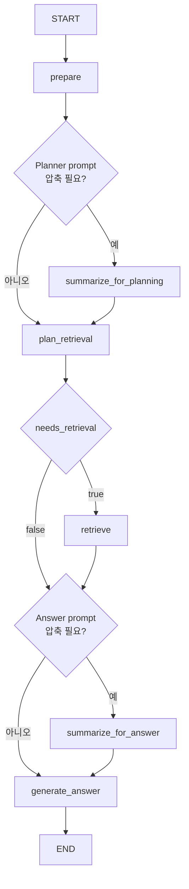
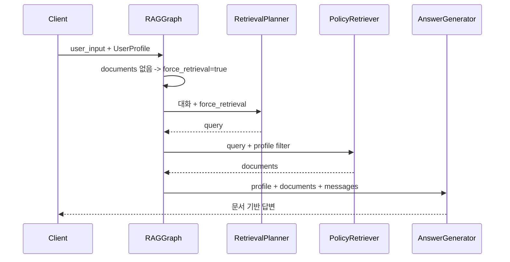
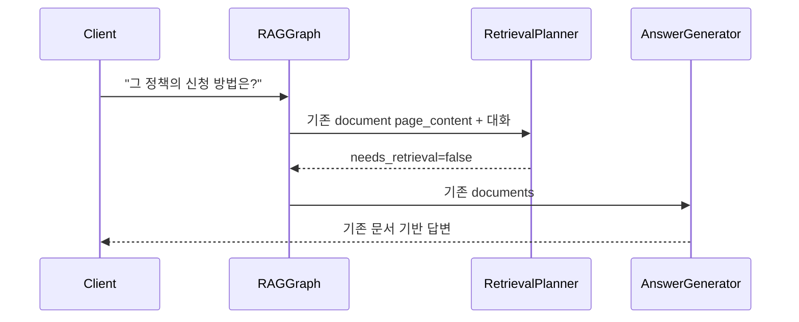
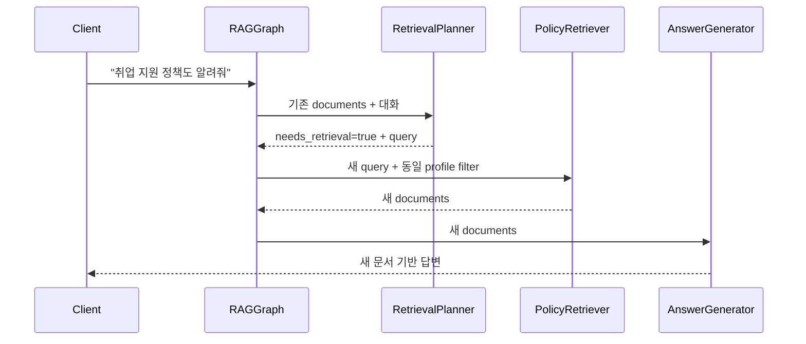

# RAG 컴포넌트 책임과 Retrieval 의사결정 기록

- 갱신일: 2026-07-02
- 기준 브랜치: `seperate-retrieval-node`
- 이전 Tool Calling 구현: `langgraph` 브랜치 `a116c49`
- 문서 성격: 개인용 설계 기록

## 1. 최종 결정

검색 판단·쿼리 작성과 답변 생성을 서로 다른 LLM 경계로 분리한다.

```text
prepare
  -> summarize_for_planning?
  -> plan_retrieval
       -> retrieve? 
       -> summarize_for_answer?
       -> generate_answer
  -> END
```

검색 실행은 LangChain Tool이 아니라 일반 LangGraph `retrieve` 노드가
`PolicyRetriever`를 직접 호출한다.

핵심 원칙은 다음과 같다.

- 문서가 없거나 프로필·만료 옵션이 변경된 경우 코드는 검색을 강제한다.
- 유효한 기존 문서가 있을 때만 LLM이 재검색 필요성을 판단한다.
- 검색 Planner는 답변을 생성하지 않는다.
- Answer Generator는 검색 판단 규칙과 Tool schema를 받지 않는다.
- 검색 후에는 그래프 edge가 답변 노드로만 이어져 재검색할 수 없다.
- 검색 Planner에는 `state.user_profile`을 전달하지 않는다.
- 프로필은 `PolicyRetriever`의 metadata filter에만 사용한다.
- Planner는 사용자가 대화에서 직접 언급한 지역·상태·정책명은 query에
  유지한다.

## 2. 전체 그래프



`summarize_for_planning`과 `summarize_for_answer`는 같은
`ConversationSummarizer`를 사용하지만, 압축 이후 복귀해야 할 노드가 다르므로
그래프 노드 이름을 분리한다.

## 3. 컴포넌트 책임

### 3.1 `RAGGraph`

파일: `src/rag/graph.py`

책임:

- LangGraph node와 edge 구성
- 외부 입력을 `RAGGraphInput`으로 변환
- 사용자 ID를 checkpointer `thread_id`로 연결
- 강제 검색 조건 계산
- 하위 컴포넌트별 request 구성
- 부분 State update 생성
- 동기·비동기·SSE API 제공
- 검색 metadata와 최종 답변을 `RAGResult`로 변환

하지 않는 일:

- 검색 필요성의 의미 판단
- query 자연어 재작성
- vector store 검색 세부 구현
- 답변 문장 생성
- LLM과 vector store 객체 생성

### 3.2 `RetrievalPlanner`

파일: `src/rag/planner.py`

입력 계약: `RetrievalPlanRequest`

- 이번 요청의 `current_question`
- 현재 `documents`
- 현재 질문을 제외한 이전 `HumanMessage`
- `conversation_summary`
- 별도 인자 `force_retrieval`

출력 계약: `RetrievalDecision`

```python
class RetrievalDecision(BaseModel):
    needs_retrieval: bool
    query: str | None
```

책임:

- 현재 문서로 질문에 답할 수 있는지 판단
- 검색이 필요하면 독립적인 자연어 query 작성
- 강제 검색 시 query 생성
- 검색하지 않을 때 query를 `None`으로 정규화

강제 검색은 LLM 판단에 맡기지 않는다. 모델이 `false`를 반환해도
`force_retrieval=True`이면 코드가 `needs_retrieval=True`로 덮어쓴다.

Planner에는 State의 사용자 프로필을 전달하지 않는다. 사용자가 실제 발화에서
직접 말한 조건은 대화 의도이므로 유지하지만, 서버 프로필 값을 query에 자동
주입하지 않는다.

`current_question`은 전체 대화와 별도로 Planner prompt의 마지막에 다시
전달한다. 이전 문서나 과거 질문에 query가 끌리는 것을 막기 위해
`last_retrieval_query`는 Planner 입력에서 제외하고 State의 관측 정보로만
유지한다.

이전 `AIMessage`도 Planner 입력에서 제외한다. 이전 답변은 검색 문서와 내용을
중복하고 잘못 생성된 내용으로 검색 판단을 오염시킬 수 있기 때문이다. Planner는
이전 사용자 질문, 현재 문서 본문, 현재 질문만으로 검색 필요성을 판단한다.

현재 문서의 충분성을 판단해야 하므로 문서별 `page_content`는 전부 전달한다.
답변용 상세 metadata formatting은 전달하지 않아 중복을 줄인다.

### 3.3 `PolicyRetriever`

파일: `src/rag/retriever.py`

입력:

- Planner가 만든 query
- `PolicySearchProfile`
- `exclude_expired`

출력:

- `list[Document]`

책임:

- 프로필 기반 metadata filter 생성
- `search_k` 적용
- vector store retriever 구성
- 동기·비동기 검색

검색 여부와 query 작성은 책임 범위가 아니다.

현재 filter가 처리하는 프로필 필드는 나이, 성별, 소득, 지역이다. `job`은
`PolicySearchProfile`에 존재하지만 아직 metadata filter에는 반영되지 않는다.

### 3.4 `AnswerGenerator`

파일: `src/rag/generator.py`

입력 계약: `GenerationRequest`

- 사용자 프로필
- 현재 정책 문서
- 누적 대화
- 대화 요약
- 검색 오류 상태

책임:

- 현재 문서에 근거한 최종 답변 생성
- 사용자 조건과 정책 조건 비교
- 문서에 없는 정보의 미확인 처리
- 질문에 필요한 필드만 유연하게 출력

답변 프롬프트에는 검색 여부, query 작성, Tool 호출 규칙을 넣지 않는다.
이전 대화는 질문의 의미를 해석하는 용도로만 사용하고 정책 사실은 현재 문서를
유일한 근거로 사용한다.

### 3.5 `ConversationSummarizer`

파일: `src/rag/summarizer.py`

책임:

- 실제 Planner 또는 Generator prompt 크기 근사 계산
- 오래된 대화 선택
- 기존 요약과 새 대화를 통합
- 제거할 message ID 반환

`RemoveMessage` 생성과 State 반영은 `RAGGraph`가 담당한다.

### 3.6 State

파일: `src/rag/state.py`

주요 필드:

| 필드 | 목적 |
|---|---|
| `messages` | 사용자별 멀티턴 대화 |
| `documents` | 현재 답변 근거로 재사용하는 정책 문서 |
| `answer` | 최종 답변 |
| `conversation_summary` | 제거된 과거 대화의 압축본 |
| `force_retrieval` | 코드가 결정한 이번 요청의 강제 검색 여부 |
| `needs_retrieval` | Planner 결과와 강제 조건을 합친 최종 검색 결정 |
| `retrieval_query` | 이번 요청에서 사용할 query |
| `retrieval_error` | 검색 실패를 Answer Generator에 전달하는 안전한 문구 |
| `last_retrieval_query` | 현재 문서를 만든 마지막 검색어 |
| `last_retrieval_profile` | 프로필 변경 감지용 snapshot |
| `last_retrieval_exclude_expired` | 만료 옵션 변경 감지용 snapshot |

이전 `retrieval_mode=required/optional/disabled`는 제거했다. 강제 검색은
`force_retrieval`, 의미 판단 결과는 `needs_retrieval`, 검색 후 재호출 금지는
그래프 edge가 각각 담당한다.

### 3.7 `factory.py`

`build_rag_graph()`는 composition root다.

```text
config
  -> embeddings
  -> vector store
  -> chat model
  -> checkpointer
  -> PolicyRetriever
  -> ConversationSummarizer
  -> RetrievalPlanner
  -> AnswerGenerator
  -> RAGGraph
```

Planner, Retriever, Generator를 `RAGGraph.__init__()`에서 직접 만들지 않고
주입하므로 각 컴포넌트를 독립적으로 테스트하거나 교체할 수 있다.

## 4. 실행 흐름

### 4.1 최초 질문



### 4.2 기존 정책의 후속 질문



### 4.3 새로운 주제



### 4.4 프로필 또는 만료 옵션 변경

`prepare`가 마지막 검색 snapshot과 현재 값을 비교한다.

```text
변경 없음 -> 기존 문서를 Planner 판단 대상으로 유지
변경 있음 -> 기존 문서 제거 + force_retrieval=true
```

LLM은 강제 검색 여부를 바꿀 수 없으며 query 작성만 담당한다.

## 5. 의사결정 이력

### 5.1 매 요청 Retrieval

장점은 단순성이지만 멀티턴에서 불필요한 검색, 순위 변동, 대명사형 query의
검색 실패가 발생한다. 기존 문서를 재사용하도록 변경했다.

### 5.2 별도 판단 노드

검색 판단과 답변 생성을 분리하면 호출이 항상 두 번 발생한다는 이유로 초기에는
비용과 latency를 우려했다.

### 5.3 단일 Tool Calling Agent

`langgraph` 브랜치 `a116c49`에서 다음 구조를 구현했다.

```text
Agent
  -> 기존 문서로 직접 답변
  -> search_policies Tool -> Agent 최종 답변
```

검색하지 않는 후속 질문은 LLM 한 번으로 처리할 수 있었다. 반면 하나의
프롬프트가 검색 충분성 판단, query 작성, 프로필 해석, 답변 생성, 출력 형식을
동시에 담당했다.

실제 테스트 과정에서 다음 문제가 확인됐다.

- query를 짧은 명사구로 압축하면서 embedding 순위가 나빠질 수 있었다.
- 질문에 있는 지역이 프로필 filter에 없는데도 query에서 제거되는 사례가 있었다.
- 검색 판단 규칙이 답변 규칙보다 길어져 지시 우선순위가 흐려졌다.
- Tool이 바인딩된 모델이 검색 판단과 직접 답변을 함께 수행했다.
- 검색 후 최종 답변 chain에도 Tool 판단 지시가 남았다.
- 검색과 답변 품질을 독립적으로 평가하기 어려웠다.

Tool Calling 자체가 vector search를 저하한 것은 아니다. Agent가 만든 query의
분포와 복합 프롬프트가 기존 원문 query·답변 prompt와 달라진 것이 핵심이다.

### 5.4 별도 Planner와 Generator로 복귀

정책 안내 서비스에서는 LLM 호출 한 번 절약보다 검색 정확도와 근거성이
중요하다고 판단했다.

최종 선택의 대가는 다음과 같다.

- 검색하지 않는 후속 질문도 Planner + Generator 두 번의 LLM 호출
- 두 노드가 일부 대화와 문서를 중복해서 읽는 비용
- 구조화 decision State가 추가됨

대신 얻는 이점은 다음과 같다.

- 검색 판단과 답변 프롬프트를 독립적으로 최적화
- query, retrieval 결과, 최종 답변을 단계별 평가
- 답변 노드에서 Tool schema와 검색 지시 완전 제거
- graph edge로 검색 횟수 상한 보장
- Planner 또는 Generator 모델을 나중에 독립 교체 가능

## 6. 불변 조건

- 같은 `UserProfile.user_id`는 같은 checkpointer thread를 사용한다.
- 최초 요청과 검색 조건 변경은 반드시 검색한다.
- Planner에는 State 사용자 프로필을 전달하지 않는다.
- Retriever에는 서버가 보유한 프로필을 직접 전달한다.
- 기존 문서의 충분성 판단에는 `page_content`를 사용한다.
- 한 요청에서 `retrieve` 노드는 최대 한 번 실행된다.
- `retrieve` 이후에는 `generate_answer` 방향으로만 진행한다.
- 최종 답변은 현재 `documents`만 정책 사실의 근거로 사용한다.
- Planner와 Generator는 전체 `RAGGraphState`가 아니라 별도 request를 받는다.
- 동기, 비동기, 스트리밍은 같은 compiled graph를 사용한다.

## 7. 검증 범위

현재 자동 테스트가 확인하는 항목:

- 강제 검색이 모델의 `false` 판단을 덮어씀
- 검색하지 않을 때 불필요한 query 제거
- Planner prompt에 profile 객체가 들어가지 않음
- Planner가 문서 `page_content`를 확인
- 최초 질문·프로필 변경 시 검색
- 기존 문서 후속 질문은 검색 생략
- 새 주제는 Planner query로 검색
- 검색 이후 답변 노드로 종료
- 사용자별 대화 격리와 SQLite 복원
- 대화 압축
- 동기·비동기·SSE 결과 형태

실제 Solar 기반 품질 평가는 이번 변경 범위에서 보류했다. 현재 평가 데이터는
단발 검색 중심이므로 다음 구조를 포함하도록 새로 설계해야 한다.

- 검색이 필요한 후속 질문
- 검색하지 않아야 하는 후속 질문
- 짧은 대명사형 질문
- 프로필 변경 직후 질문
- 질문에만 지역·상태 조건이 있는 사례
- query rewrite 전후 retrieval Recall@K
- 최종 답변의 문서 근거성

## 8. 열린 작업

- 새 멀티턴 평가 데이터셋 설계
- 실제 Solar Planner의 structured output 안정성 확인
- query rewrite와 원문 query의 retrieval A/B 평가
- context hard limit과 압축 후 재검사
- 예외 타입 및 SSE `error` 계약
- 직업 metadata filter 설계
- 실행 중인 graph node의 SSE 노출 여부
